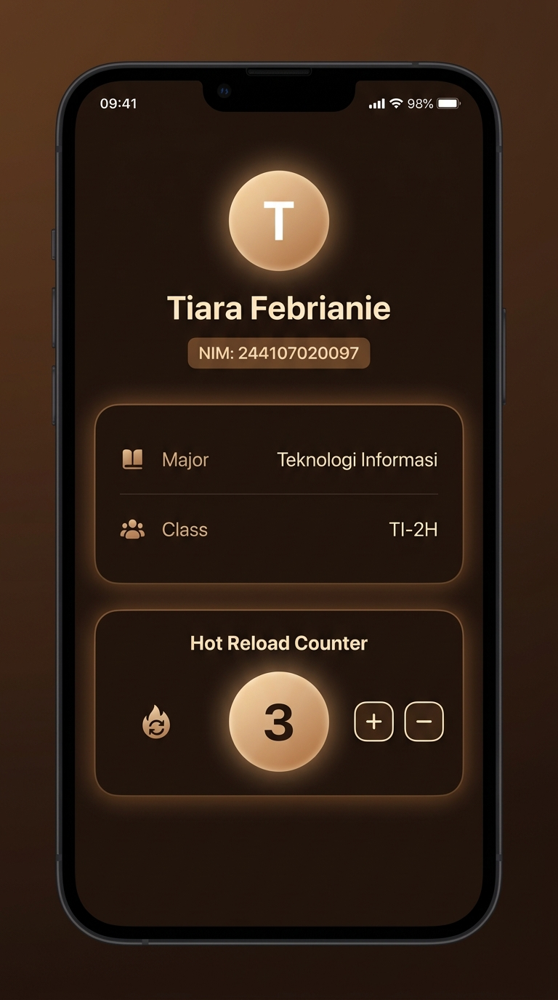

# Flutter Student Profile & Portfolio (Week 1)

This repository contains the first week's assignment for the Mobile Application Development lab. It features a premium, responsive Student Profile application with interactive state features, a built-in Hot Reload/Restart visualizer, and academic reflections.

---

## 👨‍🎓 Student Details
* **Name:** Tiara Febrianie
* **Student ID (NIM):** 244107020097
* **Major:** Teknologi Informasi (Information Technology)
* **Class:** TI-2H
* **Course:** Mobile Application Development

---

## 📱 Application Overview
The application is a state-of-the-art Student Profile dashboard featuring:
* **Interactive Profile Editor:** Users can update student details (Name, NIM, Major, Class, Email, and Hobbies) dynamically using a bottom dialog. This demonstrates **state changes** and **declarative UI rendering**.
* **Warm Brown Theme Switcher:** Fully supports Dark (Espresso) and Light (Warm Cream) themes with elegant transitions, designed with an organic, clean warm brown coffee-inspired palette.
* **Interactive Hot Reload vs Hot Restart Visualizer:** Contains an interactive state counter demonstrating how a Hot Reload preserves the counter's state, while a Hot Restart resets it to `0`.
* **Built-in Reflections Reader:** An accordion style viewer that details academic concepts.

---

## 🛠️ Setup Problem & Solution

### **The Problem**
Upon initial runs, commands like `flutter doctor` and `flutter create` hung indefinitely without outputting any logs or errors. 
Through inspection, we discovered that `flutter.bat.lock` and `lockfile` files were stuck in Flutter's cache directory (`G:\Program Files\flutter\bin\cache\`). Because the Flutter SDK was installed in the protected `Program Files` directory and owned by `Administrators`, the user-level terminal lacked write permissions (`Access is denied`), preventing it from releasing or deleting these locks.

### **The Solution**
We resolved this by performing the following steps in an elevated Administrator PowerShell terminal:
1. Deleting the stuck locks:
   ```powershell
   Remove-Item -Force "G:\Program Files\flutter\bin\cache\lockfile", "G:\Program Files\flutter\bin\cache\flutter.bat.lock"
   ```
2. Granting modify permissions to the current user group on the Flutter directory to allow future cache writes and locking:
   ```powershell
   icacls "G:\Program Files\flutter" /grant "Users:(OI)(CI)M" /T
   ```
After running these, Flutter commands began running instantly and correctly.

---

## 🔄 Hot Reload vs Hot Restart

* **Hot Reload (`r`):**
  * **Mechanism:** Compiles updated source code files and sends them to the Dart Virtual Machine (VM). The VM updates classes with the new fields and functions, then triggers a rebuild of the widget tree.
  * **State Preservation:** Keeps the current application state intact. (e.g. text inputs, counter values, active animations).
  * **Speed:** Extremely fast (typically < 1 second). Perfect for layout tweaks and color modifications.
* **Hot Restart (`R`):**
  * **Mechanism:** Reloads the code changes into the VM but restarts the app entirely.
  * **State Preservation:** Wipes out the current application state and resets it back to initial values.
  * **Speed:** Slightly slower (~1-3 seconds). Necessary when initializing state variables, static variables, or changing the main entry point `main()`.

---

## 🧠 Academic Reflections

### 1. When is native development more appropriate than cross-platform development?
Native development (Kotlin/Java for Android, Swift/Objective-C for iOS) is preferred when:
* **Deep Hardware Integration:** The app heavily uses device-specific hardware or APIs not fully wrapped by cross-platform plugins (e.g., advanced camera sensors, custom Bluetooth accessories, or low-level background threads).
* **High Performance Requirements:** Heavy graphics processing, games, or complex video rendering engine integrations.
* **Platform-Specific UI/UX:** The project strictly demands Apple-specific (Human Interface Guidelines) or Google-specific (Material 3) custom interactions that differ highly between platforms.

### 2. How does a state change relate to the widget tree and declarative UI?
* **Declarative Paradigm:** In declarative frameworks like Flutter, the UI is represented as a function of the application state:  
  $$\text{UI} = f(\text{State})$$
* **Widget Tree & State:** Flutter widgets are immutable configuration blocks. When a state variable changes (e.g., calling `setState()`), it flags the associated `StatefulWidget` as "dirty".
* **Rebuilding:** During the next frame, Flutter reruns the `build` method of the dirty widget, creating a new subtree. It then compares the new subtree with the old one (using `ElementTree` and `RenderObjectTree`) and efficiently updates only the rendered components that actually changed.

### 3. Why are small commits with clear messages useful for teamwork and a portfolio?
* **For Teamwork:**
  * **Traceability:** It is easier to pinpoint exactly which commit introduced a bug (using tools like `git bisect`).
  * **Code Reviews:** Reviewing a pull request with multiple small, single-purpose commits is far less overwhelming than reviewing one giant monolithic commit.
  * **Conflict Resolution:** Git merges are much cleaner, reducing merge conflict complexity.
* **For Portfolios:**
  * Shows your systematic problem-solving workflow and professional coding habits to recruiters.
  * Tells a structured story of how you designed, implemented, and tested each feature step-by-step.

---

## 📷 App Screenshot
Below is a screenshot of the running Student Portfolio application:


